## Poisonous Mushrooms Classification

### 1. Importing required libraries


```python
import numpy as np
import pandas as pd
from sklearn.preprocessing import LabelEncoder
import matplotlib.pyplot as plt
from sklearn.model_selection import train_test_split
from sklearn.ensemble import RandomForestClassifier
from sklearn.metrics import confusion_matrix,classification_report,matthews_corrcoef, roc_auc_score, confusion_matrix, accuracy_score, roc_curve, auc,f1_score
from sklearn.neighbors import KNeighborsClassifier
from sklearn.model_selection import cross_val_score
import seaborn as sb
```

### 2. Reading CSV Data


```python
dfmushroom = pd.read_csv('mushrooms.csv')
dfmushroom.head()
```


<div>
<style scoped>
    .dataframe tbody tr th:only-of-type {
        vertical-align: middle;
    }

    .dataframe tbody tr th {
        vertical-align: top;
    }

    .dataframe thead th {
        text-align: right;
    }
</style>
<table border="1" class="dataframe">
  <thead>
    <tr style="text-align: right;">
      <th></th>
      <th>class</th>
      <th>cap-shape</th>
      <th>cap-surface</th>
      <th>cap-color</th>
      <th>bruises</th>
      <th>odor</th>
      <th>gill-attachment</th>
      <th>gill-spacing</th>
      <th>gill-size</th>
      <th>gill-color</th>
      <th>...</th>
      <th>stalk-surface-above-ring</th>
      <th>stalk-surface-below-ring</th>
      <th>stalk-color-above-ring</th>
      <th>stalk-color-below-ring</th>
      <th>veil-color</th>
      <th>ring-number</th>
      <th>ring-type</th>
      <th>spore-print-color</th>
      <th>population</th>
      <th>habitat</th>
    </tr>
  </thead>
  <tbody>
    <tr>
      <td>0</td>
      <td>p</td>
      <td>x</td>
      <td>s</td>
      <td>n</td>
      <td>t</td>
      <td>p</td>
      <td>f</td>
      <td>c</td>
      <td>n</td>
      <td>k</td>
      <td>...</td>
      <td>s</td>
      <td>s</td>
      <td>w</td>
      <td>w</td>
      <td>w</td>
      <td>o</td>
      <td>p</td>
      <td>k</td>
      <td>s</td>
      <td>u</td>
    </tr>
    <tr>
      <td>1</td>
      <td>e</td>
      <td>x</td>
      <td>s</td>
      <td>y</td>
      <td>t</td>
      <td>a</td>
      <td>f</td>
      <td>c</td>
      <td>b</td>
      <td>k</td>
      <td>...</td>
      <td>s</td>
      <td>s</td>
      <td>w</td>
      <td>w</td>
      <td>w</td>
      <td>o</td>
      <td>p</td>
      <td>n</td>
      <td>n</td>
      <td>g</td>
    </tr>
    <tr>
      <td>2</td>
      <td>e</td>
      <td>b</td>
      <td>s</td>
      <td>w</td>
      <td>t</td>
      <td>l</td>
      <td>f</td>
      <td>c</td>
      <td>b</td>
      <td>n</td>
      <td>...</td>
      <td>s</td>
      <td>s</td>
      <td>w</td>
      <td>w</td>
      <td>w</td>
      <td>o</td>
      <td>p</td>
      <td>n</td>
      <td>n</td>
      <td>m</td>
    </tr>
    <tr>
      <td>3</td>
      <td>p</td>
      <td>x</td>
      <td>y</td>
      <td>w</td>
      <td>t</td>
      <td>p</td>
      <td>f</td>
      <td>c</td>
      <td>n</td>
      <td>n</td>
      <td>...</td>
      <td>s</td>
      <td>s</td>
      <td>w</td>
      <td>w</td>
      <td>w</td>
      <td>o</td>
      <td>p</td>
      <td>k</td>
      <td>s</td>
      <td>u</td>
    </tr>
    <tr>
      <td>4</td>
      <td>e</td>
      <td>x</td>
      <td>s</td>
      <td>g</td>
      <td>f</td>
      <td>n</td>
      <td>f</td>
      <td>w</td>
      <td>b</td>
      <td>k</td>
      <td>...</td>
      <td>s</td>
      <td>s</td>
      <td>w</td>
      <td>w</td>
      <td>w</td>
      <td>o</td>
      <td>e</td>
      <td>n</td>
      <td>a</td>
      <td>g</td>
    </tr>
  </tbody>
</table>
<p>5 rows × 22 columns</p>
</div>


### 3. Translating Alphabetical signs into words from 'Mushroom Notes.txt' notes


```python
dfmushroom['class'] = dfmushroom['class'].apply(lambda x: 'poisonous' if x == 'p' else ('non-poisonous' if x == 'e' else np.NaN))
dfmushroom['cap-shape'] = dfmushroom['cap-shape'].apply(
    lambda x: 'bell' if x == 'b' else (
        'conical' if x == 'c' else (
        'convex' if x == 'x' else (
        'flat' if x == 'f' else (
        'knobbed' if x == 'k' else(
        'sunken' if x == 's' else np.NaN
))))))
dfmushroom['cap-surface'] = dfmushroom['cap-surface'].apply(
    lambda x: 'fibrous' if x == 'f' else (
    'grooves' if x == 'g' else(
    'scaly' if x == 'y' else(
    'smooth' if x == 's' else np.NaN)))
)
dfmushroom['cap-color'] = dfmushroom['cap-color'].apply(
    lambda x: 'brown' if x == 'n' else(
    'buff' if x == 'b' else(
    'cinnamon' if x == 'c' else(
    'gray' if x == 'g' else(
    'green' if x == 'r' else(
    'pink' if x == 'p' else(
    'purple' if x == 'u' else(
    'red' if x == 'e' else(
    'white' if x == 'w' else(
    'yellow' if x == 'y' else np.NaN
    )))))))))
)
dfmushroom['bruises'] = dfmushroom['bruises'].apply(
    lambda x: 'bruises' if x == 't' else(
    'no' if x == 'f' else np.NaN)
)
dfmushroom['odor'] = dfmushroom['odor'].apply(
    lambda x: 'almond' if x == 'a' else(
    'anise' if x == 'l' else(
    'creosote' if x == 'c' else(
    'fishy' if x == 'y' else(
    'foul' if x == 'f' else(
    'musty' if x == 'm' else(
    'none' if x == 'n' else(
    'pungent' if x == 'p' else(
    'spicy' if x == 's' else np.NaN
    ))))))))
)
dfmushroom['gill-attachment'] = dfmushroom['gill-attachment'].apply(
    lambda x: 'attached' if x == 'a' else(
    'descending' if x == 'd' else(
    'free' if x == 'f' else(
    'notched' if x == 'n' else np.NaN
    )))
)
dfmushroom['gill-spacing'] = dfmushroom['gill-spacing'].apply(
    lambda x: 'close' if x == 'c' else(
    'crowded' if x == 'w' else(
    'distant' if x == 'd' else np.NaN))
)
dfmushroom['gill-size'] = dfmushroom['gill-size'].apply(
    lambda x: 'broad' if x == 'b' else(
    'narrow' if x == 'n' else np.NaN)
)
dfmushroom['gill-color'] = dfmushroom['gill-color'].apply(
    lambda x: 'black' if x == 'k' else(
    'brown' if x == 'n' else(
    'buff' if x == 'b' else(
    'chocolate' if x == 'h' else(
    'gray' if x == 'g' else(
    'green' if x == 'r' else(
    'orange' if x == 'o' else(
    'pink' if x == 'p' else(
    'purple' if x == 'u' else(
    'red' if x == 'e' else(
    'white' if x == 'w' else(
    'yellow' if x == 'y' else np.NaN
    )))))))))))
)
dfmushroom['stalk-shape'] = dfmushroom['stalk-shape'].apply(
    lambda x: 'enlarging' if x == 'e' else(
    'tapering' if x == 't' else np.NaN)
)
dfmushroom['stalk-root'] = dfmushroom['stalk-root'].apply(
    lambda x: 'bulbous' if x == 'b' else(
    'club' if x == 'c' else(
    'cup' if x == 'u' else(
    'equal' if x == 'e' else(
    'rhizomorphs' if x == 'z' else(
    'rooted' if x == 'r' else(
    'missing' if x == '?' else np.NaN
    ))))))
)
dfmushroom['stalk-surface-above-ring'] = dfmushroom['stalk-surface-above-ring'].apply(
    lambda x: 'fibrous' if x == 'f' else(
    'scaly' if x == 'y' else(
    'silky' if x == 'k' else(
    'smooth' if x == 's' else np.NaN)))
)
dfmushroom['stalk-surface-below-ring'] = dfmushroom['stalk-surface-below-ring'].apply(
    lambda x: 'fibrous' if x == 'f' else(
    'scaly' if x == 'y' else(
    'silky' if x == 'k' else(
    'smooth' if x == 's' else np.NaN)))
)
dfmushroom['stalk-color-above-ring'] = dfmushroom['stalk-color-above-ring'].apply(
    lambda x: 'brown' if x == 'n' else(
    'buff' if x == 'b' else(
    'cinnamon' if x == 'c' else(
    'gray' if x == 'g' else(
    'orange' if x == 'o' else(
    'pink' if x == 'p' else(
    'red' if x == 'e' else(
    'white' if x == 'w' else(
    'yellow' if x == 'y' else np.NaN
    ))))))))
)
dfmushroom['stalk-color-below-ring'] = dfmushroom['stalk-color-below-ring'].apply(
    lambda x: 'brown' if x == 'n' else(
    'buff' if x == 'b' else(
    'cinnamon' if x == 'c' else(
    'gray' if x == 'g' else(
    'orange' if x == 'o' else(
    'pink' if x == 'p' else(
    'red' if x == 'e' else(
    'white' if x == 'w' else(
    'yellow' if x == 'y' else np.NaN
    ))))))))
)
dfmushroom['veil-color'] = dfmushroom['veil-color'].apply(
    lambda x: 'brown' if x == 'n' else(
    'orange' if x == 'o' else(
    'white' if x == 'w' else(
    'yellow' if x == 'y' else np.NaN)))
)
dfmushroom['ring-number'] = dfmushroom['ring-number'].apply(
    lambda x: 'none' if x == 'n' else(
    'one' if x == 'o' else(
    'two' if x == 't' else np.NaN))
)
dfmushroom['ring-type'] = dfmushroom['ring-type'].apply(
    lambda x: 'cobwebby' if x == 'c' else(
    'evanescent' if x == 'e' else(
    'flaring' if x == 'f' else(
    'large' if x == 'l' else(
    'none' if x == 'n' else(
    'pendant' if x == 'p' else(
    'sheathing' if x == 's' else(
    'zone' if x == 'z' else np.NaN)))))))
)
dfmushroom['spore-print-color'] = dfmushroom['spore-print-color'].apply(
    lambda x: 'black' if x == 'k' else(
    'brown' if x == 'n' else(
    'buff' if x == 'b' else(
    'chocolate' if x == 'h' else(
    'green' if x == 'r' else(
    'orange' if x == 'o' else(
    'purple' if x == 'u' else(
    'white' if x == 'w' else(
    'yellow' if x == 'y' else np.NaN
    ))))))))
)
dfmushroom['population'] = dfmushroom['population'].apply(
    lambda x: 'abundant' if x == 'a' else(
    'clustered' if x == 'c' else(
    'numerous' if x == 'n' else(
    'scattered' if x == 's' else(
    'several' if x == 'v' else(
    'solitary' if x == 'y' else np.NaN
    )))))
)
dfmushroom['habitat'] = dfmushroom['habitat'].apply(
    lambda x: 'grasses' if x == 'g' else(
    'leaves' if x == 'l' else(
    'meadows' if x == 'm' else(
    'paths' if x == 'p' else(
    'urban' if x == 'u' else(
    'waste' if x == 'w' else(
    'woods' if x == 'd' else np.NaN))))))
)
dfmushroom
```


<div>
<style scoped>
    .dataframe tbody tr th:only-of-type {
        vertical-align: middle;
    }

    .dataframe tbody tr th {
        vertical-align: top;
    }

    .dataframe thead th {
        text-align: right;
    }
</style>
<table border="1" class="dataframe">
  <thead>
    <tr style="text-align: right;">
      <th></th>
      <th>class</th>
      <th>cap-shape</th>
      <th>cap-surface</th>
      <th>cap-color</th>
      <th>bruises</th>
      <th>odor</th>
      <th>gill-attachment</th>
      <th>gill-spacing</th>
      <th>gill-size</th>
      <th>gill-color</th>
      <th>...</th>
      <th>stalk-surface-above-ring</th>
      <th>stalk-surface-below-ring</th>
      <th>stalk-color-above-ring</th>
      <th>stalk-color-below-ring</th>
      <th>veil-color</th>
      <th>ring-number</th>
      <th>ring-type</th>
      <th>spore-print-color</th>
      <th>population</th>
      <th>habitat</th>
    </tr>
  </thead>
  <tbody>
    <tr>
      <td>0</td>
      <td>poisonous</td>
      <td>convex</td>
      <td>smooth</td>
      <td>brown</td>
      <td>bruises</td>
      <td>pungent</td>
      <td>free</td>
      <td>close</td>
      <td>narrow</td>
      <td>black</td>
      <td>...</td>
      <td>smooth</td>
      <td>smooth</td>
      <td>white</td>
      <td>white</td>
      <td>white</td>
      <td>one</td>
      <td>pendant</td>
      <td>black</td>
      <td>scattered</td>
      <td>urban</td>
    </tr>
    <tr>
      <td>1</td>
      <td>non-poisonous</td>
      <td>convex</td>
      <td>smooth</td>
      <td>yellow</td>
      <td>bruises</td>
      <td>almond</td>
      <td>free</td>
      <td>close</td>
      <td>broad</td>
      <td>black</td>
      <td>...</td>
      <td>smooth</td>
      <td>smooth</td>
      <td>white</td>
      <td>white</td>
      <td>white</td>
      <td>one</td>
      <td>pendant</td>
      <td>brown</td>
      <td>numerous</td>
      <td>grasses</td>
    </tr>
    <tr>
      <td>2</td>
      <td>non-poisonous</td>
      <td>bell</td>
      <td>smooth</td>
      <td>white</td>
      <td>bruises</td>
      <td>anise</td>
      <td>free</td>
      <td>close</td>
      <td>broad</td>
      <td>brown</td>
      <td>...</td>
      <td>smooth</td>
      <td>smooth</td>
      <td>white</td>
      <td>white</td>
      <td>white</td>
      <td>one</td>
      <td>pendant</td>
      <td>brown</td>
      <td>numerous</td>
      <td>meadows</td>
    </tr>
    <tr>
      <td>3</td>
      <td>poisonous</td>
      <td>convex</td>
      <td>scaly</td>
      <td>white</td>
      <td>bruises</td>
      <td>pungent</td>
      <td>free</td>
      <td>close</td>
      <td>narrow</td>
      <td>brown</td>
      <td>...</td>
      <td>smooth</td>
      <td>smooth</td>
      <td>white</td>
      <td>white</td>
      <td>white</td>
      <td>one</td>
      <td>pendant</td>
      <td>black</td>
      <td>scattered</td>
      <td>urban</td>
    </tr>
    <tr>
      <td>4</td>
      <td>non-poisonous</td>
      <td>convex</td>
      <td>smooth</td>
      <td>gray</td>
      <td>no</td>
      <td>none</td>
      <td>free</td>
      <td>crowded</td>
      <td>broad</td>
      <td>black</td>
      <td>...</td>
      <td>smooth</td>
      <td>smooth</td>
      <td>white</td>
      <td>white</td>
      <td>white</td>
      <td>one</td>
      <td>evanescent</td>
      <td>brown</td>
      <td>abundant</td>
      <td>grasses</td>
    </tr>
    <tr>
      <td>...</td>
      <td>...</td>
      <td>...</td>
      <td>...</td>
      <td>...</td>
      <td>...</td>
      <td>...</td>
      <td>...</td>
      <td>...</td>
      <td>...</td>
      <td>...</td>
      <td>...</td>
      <td>...</td>
      <td>...</td>
      <td>...</td>
      <td>...</td>
      <td>...</td>
      <td>...</td>
      <td>...</td>
      <td>...</td>
      <td>...</td>
      <td>...</td>
    </tr>
    <tr>
      <td>8119</td>
      <td>non-poisonous</td>
      <td>knobbed</td>
      <td>smooth</td>
      <td>brown</td>
      <td>no</td>
      <td>none</td>
      <td>attached</td>
      <td>close</td>
      <td>broad</td>
      <td>yellow</td>
      <td>...</td>
      <td>smooth</td>
      <td>smooth</td>
      <td>orange</td>
      <td>orange</td>
      <td>orange</td>
      <td>one</td>
      <td>pendant</td>
      <td>buff</td>
      <td>clustered</td>
      <td>leaves</td>
    </tr>
    <tr>
      <td>8120</td>
      <td>non-poisonous</td>
      <td>convex</td>
      <td>smooth</td>
      <td>brown</td>
      <td>no</td>
      <td>none</td>
      <td>attached</td>
      <td>close</td>
      <td>broad</td>
      <td>yellow</td>
      <td>...</td>
      <td>smooth</td>
      <td>smooth</td>
      <td>orange</td>
      <td>orange</td>
      <td>brown</td>
      <td>one</td>
      <td>pendant</td>
      <td>buff</td>
      <td>several</td>
      <td>leaves</td>
    </tr>
    <tr>
      <td>8121</td>
      <td>non-poisonous</td>
      <td>flat</td>
      <td>smooth</td>
      <td>brown</td>
      <td>no</td>
      <td>none</td>
      <td>attached</td>
      <td>close</td>
      <td>broad</td>
      <td>brown</td>
      <td>...</td>
      <td>smooth</td>
      <td>smooth</td>
      <td>orange</td>
      <td>orange</td>
      <td>orange</td>
      <td>one</td>
      <td>pendant</td>
      <td>buff</td>
      <td>clustered</td>
      <td>leaves</td>
    </tr>
    <tr>
      <td>8122</td>
      <td>poisonous</td>
      <td>knobbed</td>
      <td>scaly</td>
      <td>brown</td>
      <td>no</td>
      <td>fishy</td>
      <td>free</td>
      <td>close</td>
      <td>narrow</td>
      <td>buff</td>
      <td>...</td>
      <td>smooth</td>
      <td>silky</td>
      <td>white</td>
      <td>white</td>
      <td>white</td>
      <td>one</td>
      <td>evanescent</td>
      <td>white</td>
      <td>several</td>
      <td>leaves</td>
    </tr>
    <tr>
      <td>8123</td>
      <td>non-poisonous</td>
      <td>convex</td>
      <td>smooth</td>
      <td>brown</td>
      <td>no</td>
      <td>none</td>
      <td>attached</td>
      <td>close</td>
      <td>broad</td>
      <td>yellow</td>
      <td>...</td>
      <td>smooth</td>
      <td>smooth</td>
      <td>orange</td>
      <td>orange</td>
      <td>orange</td>
      <td>one</td>
      <td>pendant</td>
      <td>orange</td>
      <td>clustered</td>
      <td>leaves</td>
    </tr>
  </tbody>
</table>
<p>8124 rows × 22 columns</p>
</div>


### 4. Data Visualisation


```python
dfmushroom.isnull().sum()
```


    class                       0
    cap-shape                   0
    cap-surface                 0
    cap-color                   0
    bruises                     0
    odor                        0
    gill-attachment             0
    gill-spacing                0
    gill-size                   0
    gill-color                  0
    stalk-shape                 0
    stalk-root                  0
    stalk-surface-above-ring    0
    stalk-surface-below-ring    0
    stalk-color-above-ring      0
    stalk-color-below-ring      0
    veil-color                  0
    ring-number                 0
    ring-type                   0
    spore-print-color           0
    population                  0
    habitat                     0
    dtype: int64


```python
dfmushroom['class'].value_counts()
```


    non-poisonous    4208
    poisonous        3916
    Name: class, dtype: int64


```python
sb.countplot(x=dfmushroom['class'])
```


    <matplotlib.axes._subplots.AxesSubplot at 0x1d59253a488>


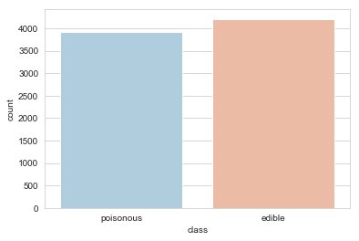


```python
dfmushroom['cap-shape'].value_counts()
```


    convex     3656
    flat       3152
    knobbed     828
    bell        452
    sunken       32
    conical       4
    Name: cap-shape, dtype: int64


```python
sb.countplot(x=dfmushroom['cap-shape'])
```


    <matplotlib.axes._subplots.AxesSubplot at 0x1d592595288>


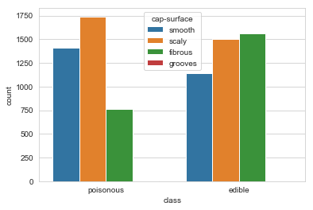


```python
dfmushroom['cap-surface'].value_counts()
```


    scaly      3244
    smooth     2556
    fibrous    2320
    grooves       4
    Name: cap-surface, dtype: int64


```python
sb.countplot(x=dfmushroom['cap-surface'])
```


    <matplotlib.axes._subplots.AxesSubplot at 0x1d592a36a48>


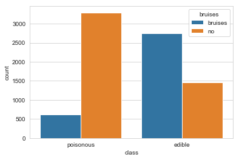


```python
dfmushroom['bruises'].value_counts()
```


    no         4748
    bruises    3376
    Name: bruises, dtype: int64


```python
sb.countplot(x=dfmushroom['bruises'])
```


    <matplotlib.axes._subplots.AxesSubplot at 0x1d592593848>


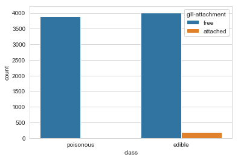


```python
dfmushroom['odor'].value_counts()
```


    none        3528
    foul        2160
    spicy        576
    fishy        576
    anise        400
    almond       400
    pungent      256
    creosote     192
    musty         36
    Name: odor, dtype: int64


```python
sb.countplot(x=dfmushroom['odor'])
```


    <matplotlib.axes._subplots.AxesSubplot at 0x1d592ae1a08>


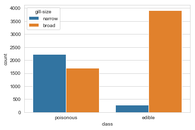


```python
dfmushroom['gill-attachment'].value_counts()
```


    free        7914
    attached     210
    Name: gill-attachment, dtype: int64


```python
sb.countplot(x=dfmushroom['gill-attachment'])
```


    <matplotlib.axes._subplots.AxesSubplot at 0x1d592b73188>


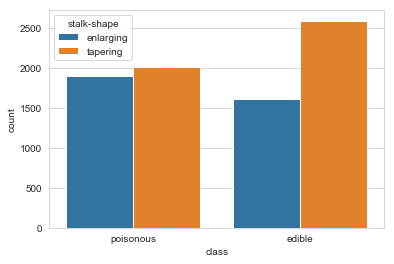


```python
dfmushroom['gill-spacing'].value_counts()
```


    close      6812
    crowded    1312
    Name: gill-spacing, dtype: int64


```python
sb.countplot(x=dfmushroom['gill-spacing'])
```


    <matplotlib.axes._subplots.AxesSubplot at 0x1d592bd74c8>


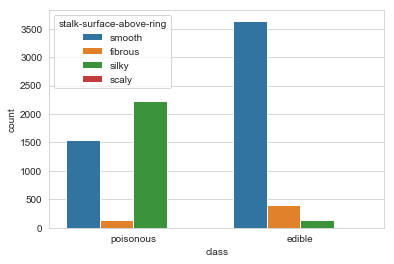


```python
dfmushroom['gill-size'].value_counts()
```


    broad     5612
    narrow    2512
    Name: gill-size, dtype: int64


```python
sb.countplot(x=dfmushroom['gill-size'])
```


    <matplotlib.axes._subplots.AxesSubplot at 0x1d592c2f8c8>


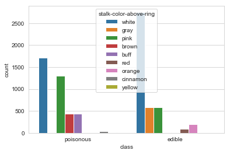


```python
dfmushroom['gill-color'].value_counts()
```


    buff         1728
    pink         1492
    white        1202
    brown        1048
    gray          752
    chocolate     732
    purple        492
    black         408
    red            96
    yellow         86
    orange         64
    green          24
    Name: gill-color, dtype: int64


```python
sb.countplot(x=dfmushroom['gill-color'])
```


    <matplotlib.axes._subplots.AxesSubplot at 0x1d592c89ac8>


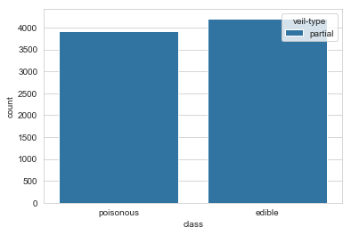


```python
dfmushroom['stalk-shape'].value_counts()
```


    tapering     4608
    enlarging    3516
    Name: stalk-shape, dtype: int64


```python
sb.countplot(x=dfmushroom['stalk-shape'])
```


    <matplotlib.axes._subplots.AxesSubplot at 0x1d592d11848>


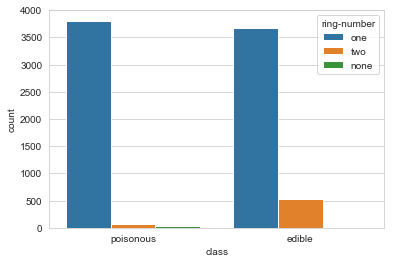


```python
dfmushroom['stalk-root'].value_counts()
```


    bulbous    3776
    missing    2480
    equal      1120
    club        556
    rooted      192
    Name: stalk-root, dtype: int64


```python
sb.countplot(x=dfmushroom['stalk-root'])
```


    <matplotlib.axes._subplots.AxesSubplot at 0x1d592d69cc8>


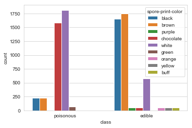


```python
dfmushroom['stalk-surface-above-ring'].value_counts()
```


    smooth     5176
    silky      2372
    fibrous     552
    scaly        24
    Name: stalk-surface-above-ring, dtype: int64


```python
sb.countplot(x=dfmushroom['stalk-surface-above-ring'])
```


    <matplotlib.axes._subplots.AxesSubplot at 0x1d592dc6308>


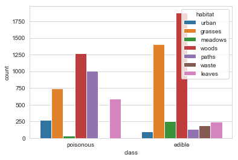


```python
dfmushroom['stalk-surface-below-ring'].value_counts()
```


    smooth     4936
    silky      2304
    fibrous     600
    scaly       284
    Name: stalk-surface-below-ring, dtype: int64


```python
sb.countplot(x=dfmushroom['stalk-surface-below-ring'])
```


    <matplotlib.axes._subplots.AxesSubplot at 0x1d592e4b688>


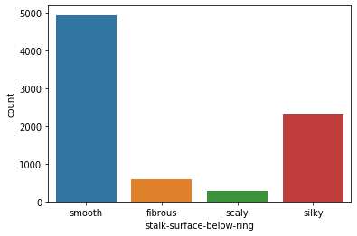


```python
dfmushroom['stalk-color-above-ring'].value_counts()
```


    white       4464
    pink        1872
    gray         576
    brown        448
    buff         432
    orange       192
    red           96
    cinnamon      36
    yellow         8
    Name: stalk-color-above-ring, dtype: int64


```python
sb.countplot(x=dfmushroom['stalk-color-above-ring'])
```


    <matplotlib.axes._subplots.AxesSubplot at 0x1d591dbaf08>


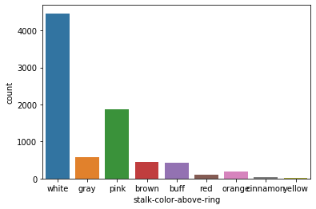


```python
dfmushroom['stalk-color-below-ring'].value_counts()
```


    white       4384
    pink        1872
    gray         576
    brown        512
    buff         432
    orange       192
    red           96
    cinnamon      36
    yellow        24
    Name: stalk-color-below-ring, dtype: int64


```python
sb.countplot(x=dfmushroom['stalk-color-below-ring'])
```


    <matplotlib.axes._subplots.AxesSubplot at 0x1d592f25d88>


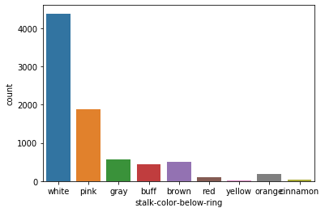


```python
dfmushroom['veil-color'].value_counts()
```


    white     7924
    brown       96
    orange      96
    yellow       8
    Name: veil-color, dtype: int64


```python
sb.countplot(x=dfmushroom['veil-color'])
```


    <matplotlib.axes._subplots.AxesSubplot at 0x1d592f978c8>


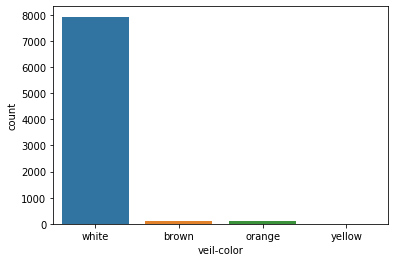


```python
dfmushroom['ring-number'].value_counts()
```


    one     7488
    two      600
    none      36
    Name: ring-number, dtype: int64


```python
sb.countplot(x=dfmushroom['ring-number'])
```


    <matplotlib.axes._subplots.AxesSubplot at 0x1d593fd5bc8>


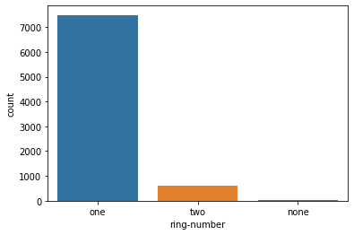


```python
dfmushroom['ring-type'].value_counts()
```


    pendant       3968
    evanescent    2776
    large         1296
    flaring         48
    none            36
    Name: ring-type, dtype: int64


```python
sb.countplot(x=dfmushroom['ring-type'])
```


    <matplotlib.axes._subplots.AxesSubplot at 0x1d59403d788>


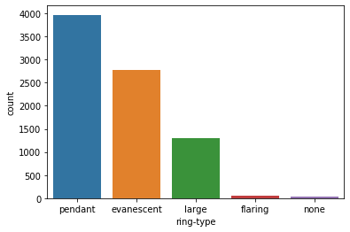


```python
dfmushroom['spore-print-color'].value_counts()
```


    white        2388
    brown        1968
    black        1872
    chocolate    1632
    green          72
    yellow         48
    buff           48
    purple         48
    orange         48
    Name: spore-print-color, dtype: int64


```python
sb.countplot(x=dfmushroom['spore-print-color'])
```


    <matplotlib.axes._subplots.AxesSubplot at 0x1d590b10908>


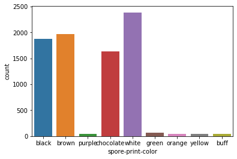


```python
dfmushroom['population'].value_counts()
```


    several      4040
    solitary     1712
    scattered    1248
    numerous      400
    abundant      384
    clustered     340
    Name: population, dtype: int64


```python
sb.countplot(x=dfmushroom['population'])
```


    <matplotlib.axes._subplots.AxesSubplot at 0x1d59412a788>


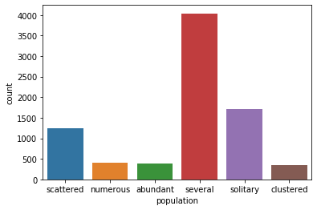


```python
dfmushroom['habitat'].value_counts()
```


    woods      3148
    grasses    2148
    paths      1144
    leaves      832
    urban       368
    meadows     292
    waste       192
    Name: habitat, dtype: int64


```python
sb.countplot(x=dfmushroom['habitat'])
```


    <matplotlib.axes._subplots.AxesSubplot at 0x1d5941a1748>


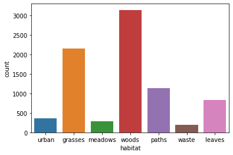


### 5. Labeling Data using Label Encoder


```python
labelencoder=LabelEncoder()
for col in dfmushroom.columns:
    dfmushroom[col] = labelencoder.fit_transform(dfmushroom[col])
dfmushroom.head()
```


<div>
<style scoped>
    .dataframe tbody tr th:only-of-type {
        vertical-align: middle;
    }

    .dataframe tbody tr th {
        vertical-align: top;
    }

    .dataframe thead th {
        text-align: right;
    }
</style>
<table border="1" class="dataframe">
  <thead>
    <tr style="text-align: right;">
      <th></th>
      <th>class</th>
      <th>cap-shape</th>
      <th>cap-surface</th>
      <th>cap-color</th>
      <th>bruises</th>
      <th>odor</th>
      <th>gill-attachment</th>
      <th>gill-spacing</th>
      <th>gill-size</th>
      <th>gill-color</th>
      <th>...</th>
      <th>stalk-surface-above-ring</th>
      <th>stalk-surface-below-ring</th>
      <th>stalk-color-above-ring</th>
      <th>stalk-color-below-ring</th>
      <th>veil-color</th>
      <th>ring-number</th>
      <th>ring-type</th>
      <th>spore-print-color</th>
      <th>population</th>
      <th>habitat</th>
    </tr>
  </thead>
  <tbody>
    <tr>
      <td>0</td>
      <td>1</td>
      <td>2</td>
      <td>3</td>
      <td>0</td>
      <td>0</td>
      <td>7</td>
      <td>1</td>
      <td>0</td>
      <td>1</td>
      <td>0</td>
      <td>...</td>
      <td>3</td>
      <td>3</td>
      <td>7</td>
      <td>7</td>
      <td>2</td>
      <td>1</td>
      <td>4</td>
      <td>0</td>
      <td>3</td>
      <td>4</td>
    </tr>
    <tr>
      <td>1</td>
      <td>0</td>
      <td>2</td>
      <td>3</td>
      <td>9</td>
      <td>0</td>
      <td>0</td>
      <td>1</td>
      <td>0</td>
      <td>0</td>
      <td>0</td>
      <td>...</td>
      <td>3</td>
      <td>3</td>
      <td>7</td>
      <td>7</td>
      <td>2</td>
      <td>1</td>
      <td>4</td>
      <td>1</td>
      <td>2</td>
      <td>0</td>
    </tr>
    <tr>
      <td>2</td>
      <td>0</td>
      <td>0</td>
      <td>3</td>
      <td>8</td>
      <td>0</td>
      <td>1</td>
      <td>1</td>
      <td>0</td>
      <td>0</td>
      <td>1</td>
      <td>...</td>
      <td>3</td>
      <td>3</td>
      <td>7</td>
      <td>7</td>
      <td>2</td>
      <td>1</td>
      <td>4</td>
      <td>1</td>
      <td>2</td>
      <td>2</td>
    </tr>
    <tr>
      <td>3</td>
      <td>1</td>
      <td>2</td>
      <td>2</td>
      <td>8</td>
      <td>0</td>
      <td>7</td>
      <td>1</td>
      <td>0</td>
      <td>1</td>
      <td>1</td>
      <td>...</td>
      <td>3</td>
      <td>3</td>
      <td>7</td>
      <td>7</td>
      <td>2</td>
      <td>1</td>
      <td>4</td>
      <td>0</td>
      <td>3</td>
      <td>4</td>
    </tr>
    <tr>
      <td>4</td>
      <td>0</td>
      <td>2</td>
      <td>3</td>
      <td>3</td>
      <td>1</td>
      <td>6</td>
      <td>1</td>
      <td>1</td>
      <td>0</td>
      <td>0</td>
      <td>...</td>
      <td>3</td>
      <td>3</td>
      <td>7</td>
      <td>7</td>
      <td>2</td>
      <td>1</td>
      <td>0</td>
      <td>1</td>
      <td>0</td>
      <td>0</td>
    </tr>
  </tbody>
</table>
<p>5 rows × 22 columns</p>
</div>


### 6. Correlation Matrix


```python
dfmushroom.corr()
```


<div>
<style scoped>
    .dataframe tbody tr th:only-of-type {
        vertical-align: middle;
    }

    .dataframe tbody tr th {
        vertical-align: top;
    }

    .dataframe thead th {
        text-align: right;
    }
</style>
<table border="1" class="dataframe">
  <thead>
    <tr style="text-align: right;">
      <th></th>
      <th>class</th>
      <th>cap-shape</th>
      <th>cap-surface</th>
      <th>cap-color</th>
      <th>bruises</th>
      <th>odor</th>
      <th>gill-attachment</th>
      <th>gill-spacing</th>
      <th>gill-size</th>
      <th>gill-color</th>
      <th>...</th>
      <th>stalk-surface-above-ring</th>
      <th>stalk-surface-below-ring</th>
      <th>stalk-color-above-ring</th>
      <th>stalk-color-below-ring</th>
      <th>veil-color</th>
      <th>ring-number</th>
      <th>ring-type</th>
      <th>spore-print-color</th>
      <th>population</th>
      <th>habitat</th>
    </tr>
  </thead>
  <tbody>
    <tr>
      <td>class</td>
      <td>1.000000</td>
      <td>0.199488</td>
      <td>0.186806</td>
      <td>0.058452</td>
      <td>0.501530</td>
      <td>-0.086800</td>
      <td>0.129200</td>
      <td>-0.348387</td>
      <td>0.540024</td>
      <td>-0.270247</td>
      <td>...</td>
      <td>-0.215088</td>
      <td>-0.139254</td>
      <td>-0.263928</td>
      <td>-0.245231</td>
      <td>0.145142</td>
      <td>-0.214366</td>
      <td>-0.411771</td>
      <td>0.519438</td>
      <td>0.298686</td>
      <td>-0.022363</td>
    </tr>
    <tr>
      <td>cap-shape</td>
      <td>0.199488</td>
      <td>1.000000</td>
      <td>-0.007059</td>
      <td>-0.176574</td>
      <td>0.199703</td>
      <td>0.251055</td>
      <td>0.032099</td>
      <td>-0.061368</td>
      <td>0.259001</td>
      <td>-0.069180</td>
      <td>...</td>
      <td>-0.070942</td>
      <td>-0.068732</td>
      <td>-0.059667</td>
      <td>-0.067470</td>
      <td>0.036995</td>
      <td>-0.069245</td>
      <td>-0.304673</td>
      <td>0.251207</td>
      <td>0.129000</td>
      <td>0.134210</td>
    </tr>
    <tr>
      <td>cap-surface</td>
      <td>0.186806</td>
      <td>-0.007059</td>
      <td>1.000000</td>
      <td>-0.022923</td>
      <td>0.019547</td>
      <td>-0.105749</td>
      <td>-0.161757</td>
      <td>-0.096076</td>
      <td>0.274933</td>
      <td>-0.122924</td>
      <td>...</td>
      <td>0.015424</td>
      <td>-0.000094</td>
      <td>0.250617</td>
      <td>0.260090</td>
      <td>-0.154804</td>
      <td>0.060429</td>
      <td>-0.171361</td>
      <td>0.310188</td>
      <td>-0.188979</td>
      <td>-0.191609</td>
    </tr>
    <tr>
      <td>cap-color</td>
      <td>0.058452</td>
      <td>-0.176574</td>
      <td>-0.022923</td>
      <td>1.000000</td>
      <td>-0.034513</td>
      <td>-0.318907</td>
      <td>0.192322</td>
      <td>0.023269</td>
      <td>-0.091914</td>
      <td>-0.020306</td>
      <td>...</td>
      <td>-0.017087</td>
      <td>-0.026967</td>
      <td>-0.044439</td>
      <td>-0.025502</td>
      <td>0.188903</td>
      <td>0.010226</td>
      <td>0.088491</td>
      <td>-0.079787</td>
      <td>-0.017712</td>
      <td>-0.089724</td>
    </tr>
    <tr>
      <td>bruises</td>
      <td>0.501530</td>
      <td>0.199703</td>
      <td>0.019547</td>
      <td>-0.034513</td>
      <td>1.000000</td>
      <td>0.079235</td>
      <td>-0.137359</td>
      <td>0.299473</td>
      <td>0.369596</td>
      <td>-0.348658</td>
      <td>...</td>
      <td>-0.386893</td>
      <td>-0.323013</td>
      <td>-0.197177</td>
      <td>-0.213054</td>
      <td>-0.119770</td>
      <td>-0.056788</td>
      <td>-0.692973</td>
      <td>0.519982</td>
      <td>-0.088137</td>
      <td>-0.305354</td>
    </tr>
    <tr>
      <td>odor</td>
      <td>-0.086800</td>
      <td>0.251055</td>
      <td>-0.105749</td>
      <td>-0.318907</td>
      <td>0.079235</td>
      <td>1.000000</td>
      <td>-0.092471</td>
      <td>0.114297</td>
      <td>0.037037</td>
      <td>0.074913</td>
      <td>...</td>
      <td>-0.044410</td>
      <td>0.060100</td>
      <td>-0.012270</td>
      <td>-0.026790</td>
      <td>-0.086768</td>
      <td>0.164708</td>
      <td>-0.161269</td>
      <td>0.093370</td>
      <td>0.003753</td>
      <td>0.126054</td>
    </tr>
    <tr>
      <td>gill-attachment</td>
      <td>0.129200</td>
      <td>0.032099</td>
      <td>-0.161757</td>
      <td>0.192322</td>
      <td>-0.137359</td>
      <td>-0.092471</td>
      <td>1.000000</td>
      <td>0.071489</td>
      <td>0.108984</td>
      <td>-0.080726</td>
      <td>...</td>
      <td>-0.083189</td>
      <td>-0.075554</td>
      <td>0.122946</td>
      <td>0.116158</td>
      <td>0.897518</td>
      <td>0.093236</td>
      <td>-0.146689</td>
      <td>-0.068909</td>
      <td>0.165575</td>
      <td>0.115387</td>
    </tr>
    <tr>
      <td>gill-spacing</td>
      <td>-0.348387</td>
      <td>-0.061368</td>
      <td>-0.096076</td>
      <td>0.023269</td>
      <td>0.299473</td>
      <td>0.114297</td>
      <td>0.071489</td>
      <td>1.000000</td>
      <td>-0.108333</td>
      <td>-0.037735</td>
      <td>...</td>
      <td>-0.298008</td>
      <td>-0.241945</td>
      <td>0.319259</td>
      <td>0.271301</td>
      <td>0.073363</td>
      <td>0.243014</td>
      <td>-0.195897</td>
      <td>-0.092992</td>
      <td>-0.529253</td>
      <td>-0.397884</td>
    </tr>
    <tr>
      <td>gill-size</td>
      <td>0.540024</td>
      <td>0.259001</td>
      <td>0.274933</td>
      <td>-0.091914</td>
      <td>0.369596</td>
      <td>0.037037</td>
      <td>0.108984</td>
      <td>-0.108333</td>
      <td>1.000000</td>
      <td>-0.330580</td>
      <td>...</td>
      <td>0.090346</td>
      <td>0.087102</td>
      <td>0.271111</td>
      <td>0.228629</td>
      <td>0.103809</td>
      <td>-0.171362</td>
      <td>-0.460872</td>
      <td>0.549444</td>
      <td>0.147682</td>
      <td>0.088058</td>
    </tr>
    <tr>
      <td>gill-color</td>
      <td>-0.270247</td>
      <td>-0.069180</td>
      <td>-0.122924</td>
      <td>-0.020306</td>
      <td>-0.348658</td>
      <td>0.074913</td>
      <td>-0.080726</td>
      <td>-0.037735</td>
      <td>-0.330580</td>
      <td>1.000000</td>
      <td>...</td>
      <td>0.114802</td>
      <td>0.057044</td>
      <td>-0.064741</td>
      <td>-0.101458</td>
      <td>-0.048532</td>
      <td>0.235151</td>
      <td>0.389234</td>
      <td>-0.144126</td>
      <td>0.027168</td>
      <td>0.185011</td>
    </tr>
    <tr>
      <td>stalk-shape</td>
      <td>-0.102019</td>
      <td>0.248495</td>
      <td>0.037139</td>
      <td>-0.240248</td>
      <td>-0.099364</td>
      <td>0.344635</td>
      <td>0.186485</td>
      <td>0.080895</td>
      <td>0.214576</td>
      <td>-0.185632</td>
      <td>...</td>
      <td>-0.041495</td>
      <td>0.057663</td>
      <td>0.228784</td>
      <td>0.251239</td>
      <td>0.162604</td>
      <td>-0.293221</td>
      <td>-0.291444</td>
      <td>0.038177</td>
      <td>0.087383</td>
      <td>0.239285</td>
    </tr>
    <tr>
      <td>stalk-root</td>
      <td>0.094766</td>
      <td>0.175423</td>
      <td>0.386239</td>
      <td>-0.143640</td>
      <td>0.398393</td>
      <td>0.071190</td>
      <td>-0.173710</td>
      <td>0.152667</td>
      <td>0.526677</td>
      <td>-0.283404</td>
      <td>...</td>
      <td>0.004915</td>
      <td>-0.127670</td>
      <td>0.403830</td>
      <td>0.406557</td>
      <td>-0.174952</td>
      <td>0.210282</td>
      <td>-0.557202</td>
      <td>0.572069</td>
      <td>-0.341311</td>
      <td>-0.337422</td>
    </tr>
    <tr>
      <td>stalk-surface-above-ring</td>
      <td>-0.215088</td>
      <td>-0.070942</td>
      <td>0.015424</td>
      <td>-0.017087</td>
      <td>-0.386893</td>
      <td>-0.044410</td>
      <td>-0.083189</td>
      <td>-0.298008</td>
      <td>0.090346</td>
      <td>0.114802</td>
      <td>...</td>
      <td>1.000000</td>
      <td>0.377108</td>
      <td>0.098698</td>
      <td>0.122808</td>
      <td>-0.097445</td>
      <td>0.079705</td>
      <td>0.353121</td>
      <td>-0.088313</td>
      <td>0.161366</td>
      <td>0.290032</td>
    </tr>
    <tr>
      <td>stalk-surface-below-ring</td>
      <td>-0.139254</td>
      <td>-0.068732</td>
      <td>-0.000094</td>
      <td>-0.026967</td>
      <td>-0.323013</td>
      <td>0.060100</td>
      <td>-0.075554</td>
      <td>-0.241945</td>
      <td>0.087102</td>
      <td>0.057044</td>
      <td>...</td>
      <td>0.377108</td>
      <td>1.000000</td>
      <td>0.043176</td>
      <td>0.071024</td>
      <td>-0.103183</td>
      <td>0.114982</td>
      <td>0.297398</td>
      <td>-0.046367</td>
      <td>0.131140</td>
      <td>0.275485</td>
    </tr>
    <tr>
      <td>stalk-color-above-ring</td>
      <td>-0.263928</td>
      <td>-0.059667</td>
      <td>0.250617</td>
      <td>-0.044439</td>
      <td>-0.197177</td>
      <td>-0.012270</td>
      <td>0.122946</td>
      <td>0.319259</td>
      <td>0.271111</td>
      <td>-0.064741</td>
      <td>...</td>
      <td>0.098698</td>
      <td>0.043176</td>
      <td>1.000000</td>
      <td>0.634053</td>
      <td>0.103416</td>
      <td>0.179667</td>
      <td>-0.036693</td>
      <td>0.008433</td>
      <td>-0.362510</td>
      <td>-0.179663</td>
    </tr>
    <tr>
      <td>stalk-color-below-ring</td>
      <td>-0.245231</td>
      <td>-0.067470</td>
      <td>0.260090</td>
      <td>-0.025502</td>
      <td>-0.213054</td>
      <td>-0.026790</td>
      <td>0.116158</td>
      <td>0.271301</td>
      <td>0.228629</td>
      <td>-0.101458</td>
      <td>...</td>
      <td>0.122808</td>
      <td>0.071024</td>
      <td>0.634053</td>
      <td>1.000000</td>
      <td>0.097585</td>
      <td>0.181723</td>
      <td>-0.005017</td>
      <td>-0.025539</td>
      <td>-0.361025</td>
      <td>-0.164883</td>
    </tr>
    <tr>
      <td>veil-color</td>
      <td>0.145142</td>
      <td>0.036995</td>
      <td>-0.154804</td>
      <td>0.188903</td>
      <td>-0.119770</td>
      <td>-0.086768</td>
      <td>0.897518</td>
      <td>0.073363</td>
      <td>0.103809</td>
      <td>-0.048532</td>
      <td>...</td>
      <td>-0.097445</td>
      <td>-0.103183</td>
      <td>0.103416</td>
      <td>0.097585</td>
      <td>1.000000</td>
      <td>0.036380</td>
      <td>-0.143673</td>
      <td>-0.042848</td>
      <td>0.124924</td>
      <td>0.124667</td>
    </tr>
    <tr>
      <td>ring-number</td>
      <td>-0.214366</td>
      <td>-0.069245</td>
      <td>0.060429</td>
      <td>0.010226</td>
      <td>-0.056788</td>
      <td>0.164708</td>
      <td>0.093236</td>
      <td>0.243014</td>
      <td>-0.171362</td>
      <td>0.235151</td>
      <td>...</td>
      <td>0.079705</td>
      <td>0.114982</td>
      <td>0.179667</td>
      <td>0.181723</td>
      <td>0.036380</td>
      <td>1.000000</td>
      <td>0.058312</td>
      <td>0.322301</td>
      <td>-0.242020</td>
      <td>-0.149435</td>
    </tr>
    <tr>
      <td>ring-type</td>
      <td>-0.411771</td>
      <td>-0.304673</td>
      <td>-0.171361</td>
      <td>0.088491</td>
      <td>-0.692973</td>
      <td>-0.161269</td>
      <td>-0.146689</td>
      <td>-0.195897</td>
      <td>-0.460872</td>
      <td>0.389234</td>
      <td>...</td>
      <td>0.353121</td>
      <td>0.297398</td>
      <td>-0.036693</td>
      <td>-0.005017</td>
      <td>-0.143673</td>
      <td>0.058312</td>
      <td>1.000000</td>
      <td>-0.573933</td>
      <td>0.211763</td>
      <td>0.215128</td>
    </tr>
    <tr>
      <td>spore-print-color</td>
      <td>0.519438</td>
      <td>0.251207</td>
      <td>0.310188</td>
      <td>-0.079787</td>
      <td>0.519982</td>
      <td>0.093370</td>
      <td>-0.068909</td>
      <td>-0.092992</td>
      <td>0.549444</td>
      <td>-0.144126</td>
      <td>...</td>
      <td>-0.088313</td>
      <td>-0.046367</td>
      <td>0.008433</td>
      <td>-0.025539</td>
      <td>-0.042848</td>
      <td>0.322301</td>
      <td>-0.573933</td>
      <td>1.000000</td>
      <td>0.012647</td>
      <td>-0.080432</td>
    </tr>
    <tr>
      <td>population</td>
      <td>0.298686</td>
      <td>0.129000</td>
      <td>-0.188979</td>
      <td>-0.017712</td>
      <td>-0.088137</td>
      <td>0.003753</td>
      <td>0.165575</td>
      <td>-0.529253</td>
      <td>0.147682</td>
      <td>0.027168</td>
      <td>...</td>
      <td>0.161366</td>
      <td>0.131140</td>
      <td>-0.362510</td>
      <td>-0.361025</td>
      <td>0.124924</td>
      <td>-0.242020</td>
      <td>0.211763</td>
      <td>0.012647</td>
      <td>1.000000</td>
      <td>0.433095</td>
    </tr>
    <tr>
      <td>habitat</td>
      <td>-0.022363</td>
      <td>0.134210</td>
      <td>-0.191609</td>
      <td>-0.089724</td>
      <td>-0.305354</td>
      <td>0.126054</td>
      <td>0.115387</td>
      <td>-0.397884</td>
      <td>0.088058</td>
      <td>0.185011</td>
      <td>...</td>
      <td>0.290032</td>
      <td>0.275485</td>
      <td>-0.179663</td>
      <td>-0.164883</td>
      <td>0.124667</td>
      <td>-0.149435</td>
      <td>0.215128</td>
      <td>-0.080432</td>
      <td>0.433095</td>
      <td>1.000000</td>
    </tr>
  </tbody>
</table>
<p>22 rows × 22 columns</p>
</div>


```python
plt.imshow(dfmushroom.corr())
plt.xticks(np.arange(23), dfmushroom.columns, rotation = 90)
plt.yticks(np.arange(23), dfmushroom.columns)
plt.colorbar()
```


    <matplotlib.colorbar.Colorbar at 0x1d5942d45c8>


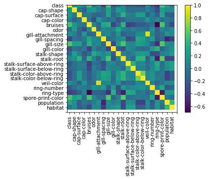


### 7. Train Test Split


```python
xtr,xts,ytr,yts = train_test_split(
    dfmushroom[['cap-shape', 'cap-surface', 'cap-color', 'bruises', 'odor',
       'gill-attachment', 'gill-spacing', 'gill-size', 'gill-color',
       'stalk-shape', 'stalk-root', 'stalk-surface-above-ring',
       'stalk-surface-below-ring', 'stalk-color-above-ring',
       'stalk-color-below-ring', 'veil-color', 'ring-number',
       'ring-type', 'spore-print-color', 'population', 'habitat']],
    dfmushroom['class'],
    test_size = .1
)
```

### 8. Applying Models (K-Nearest Neighbour, Logistic Regression, Random Forest Classifier)


```python
def nilai_k():
    k = round((len(xtr)+len(xts)) ** .5)
    if (k % 2 == 0):
        return k + 1
    else:
        return k
    
modelknn = KNeighborsClassifier(
    n_neighbors = nilai_k()
)
modelknn.fit(xtr,ytr)

logmodel = LogisticRegression(solver='lbfgs',max_iter=1000)
logmodel.fit(xtr,ytr)

modelrfc = RandomForestClassifier(n_estimators=100)
modelrfc.fit(xtr,ytr)
```


    RandomForestClassifier(bootstrap=True, class_weight=None, criterion='gini',
                           max_depth=None, max_features='auto', max_leaf_nodes=None,
                           min_impurity_decrease=0.0, min_impurity_split=None,
                           min_samples_leaf=1, min_samples_split=2,
                           min_weight_fraction_leaf=0.0, n_estimators=100,
                           n_jobs=None, oob_score=False, random_state=None,
                           verbose=0, warm_start=False)


### 9. Cross Validating Scores of each Models


```python
(cross_val_score(modelrfc,xtr,ytr,cv = 5).mean())
```


    0.9611544248392833


```python
(cross_val_score(modelknn,xtr,ytr,cv = 5).mean())
```


    0.8161561223212201


##### Based on scores above, it can be concluded that Random Forest Classifier gives the best cross validation scores. The author decided to go on with Random Forest Classifier for the rest of model validation.

### 10. Prediction, Classification Report, Confusion Matrix, ROC AUC, Accuracy, and Matthews Correlation Coefficient


```python
pred = modelrfc.predict(xts)
predProb = modelrfc.predict_proba(xts)
pred
```


    array([0, 1, 1, 1, 0, 1, 1, 0, 1, 0, 0, 0, 1, 0, 0, 0, 1, 1, 0, 0, 0, 0,
           0, 0, 0, 1, 1, 1, 0, 0, 0, 1, 0, 0, 1, 0, 1, 1, 0, 1, 0, 1, 0, 1,
           1, 0, 1, 1, 0, 1, 1, 1, 0, 1, 0, 0, 1, 0, 1, 1, 0, 0, 1, 0, 0, 0,
           1, 0, 1, 0, 0, 1, 0, 0, 1, 0, 0, 1, 1, 0, 0, 0, 1, 1, 0, 1, 1, 1,
           0, 0, 1, 1, 1, 1, 0, 1, 1, 0, 0, 0, 1, 1, 0, 0, 0, 0, 0, 1, 0, 0,
           1, 0, 1, 0, 0, 1, 0, 1, 1, 1, 1, 1, 0, 0, 0, 1, 0, 0, 1, 0, 0, 0,
           0, 1, 0, 1, 0, 0, 0, 1, 0, 1, 1, 1, 0, 0, 1, 0, 1, 1, 1, 0, 0, 1,
           0, 0, 0, 0, 0, 1, 1, 1, 1, 1, 1, 1, 0, 0, 0, 0, 1, 0, 0, 1, 0, 0,
           0, 0, 1, 0, 1, 0, 0, 0, 1, 1, 0, 1, 1, 1, 1, 1, 1, 0, 0, 1, 1, 0,
           0, 0, 0, 0, 0, 0, 0, 0, 1, 0, 0, 0, 1, 1, 1, 1, 0, 0, 1, 0, 0, 0,
           1, 0, 1, 0, 1, 0, 0, 0, 1, 0, 0, 0, 0, 0, 0, 1, 0, 1, 1, 0, 0, 0,
           1, 1, 0, 1, 1, 1, 1, 1, 0, 1, 1, 1, 1, 0, 1, 0, 1, 0, 0, 1, 0, 1,
           0, 0, 0, 0, 1, 0, 0, 0, 0, 1, 0, 0, 0, 0, 1, 0, 0, 1, 1, 1, 0, 1,
           0, 0, 0, 1, 0, 0, 1, 1, 1, 1, 1, 0, 1, 1, 0, 1, 0, 1, 1, 0, 0, 0,
           0, 0, 0, 1, 1, 1, 0, 1, 0, 1, 0, 1, 0, 0, 0, 1, 1, 0, 1, 0, 0, 1,
           1, 0, 0, 0, 0, 1, 0, 1, 1, 0, 0, 1, 1, 1, 1, 0, 0, 1, 0, 1, 1, 0,
           1, 0, 1, 1, 0, 0, 1, 0, 1, 1, 0, 0, 1, 1, 0, 1, 0, 0, 1, 0, 0, 0,
           1, 1, 0, 1, 1, 0, 0, 0, 0, 0, 0, 1, 1, 1, 1, 0, 1, 0, 0, 1, 0, 1,
           0, 1, 1, 1, 1, 1, 0, 1, 1, 1, 0, 0, 0, 1, 0, 1, 0, 1, 0, 1, 1, 0,
           0, 1, 0, 1, 1, 0, 1, 1, 0, 1, 0, 0, 0, 0, 0, 0, 1, 1, 1, 1, 0, 1,
           1, 1, 1, 0, 0, 1, 0, 0, 0, 0, 1, 1, 1, 0, 1, 0, 0, 0, 1, 0, 0, 0,
           0, 1, 0, 1, 1, 1, 1, 0, 1, 0, 0, 1, 1, 1, 0, 0, 0, 1, 1, 0, 0, 0,
           1, 1, 1, 0, 0, 1, 1, 0, 1, 0, 1, 0, 0, 1, 0, 0, 1, 1, 1, 1, 0, 0,
           0, 1, 1, 0, 0, 1, 0, 1, 1, 1, 1, 1, 1, 0, 1, 1, 0, 1, 0, 0, 0, 0,
           1, 1, 0, 0, 0, 1, 0, 0, 0, 0, 0, 0, 0, 0, 1, 0, 1, 1, 1, 1, 0, 0,
           0, 1, 0, 0, 1, 1, 0, 1, 0, 1, 1, 0, 0, 0, 0, 1, 0, 1, 1, 0, 0, 1,
           0, 1, 0, 1, 1, 0, 0, 0, 0, 1, 1, 0, 1, 1, 0, 1, 1, 1, 0, 0, 1, 1,
           1, 1, 0, 1, 0, 0, 0, 1, 1, 0, 0, 0, 0, 0, 1, 1, 0, 1, 0, 0, 0, 0,
           1, 1, 1, 0, 0, 1, 1, 1, 1, 1, 0, 1, 0, 1, 0, 1, 1, 1, 0, 1, 1, 1,
           1, 1, 1, 1, 1, 0, 1, 0, 1, 0, 1, 0, 0, 0, 1, 0, 0, 0, 1, 1, 0, 1,
           0, 0, 1, 1, 0, 1, 0, 0, 0, 0, 1, 1, 1, 1, 1, 1, 0, 1, 0, 0, 1, 0,
           1, 0, 0, 1, 0, 1, 1, 0, 1, 0, 0, 0, 0, 0, 1, 0, 0, 0, 1, 0, 0, 0,
           1, 0, 1, 1, 0, 0, 0, 0, 0, 1, 1, 0, 0, 0, 1, 0, 0, 1, 0, 0, 1, 0,
           0, 1, 1, 0, 1, 0, 0, 1, 1, 1, 1, 0, 0, 0, 0, 0, 0, 1, 1, 1, 1, 0,
           0, 1, 0, 1, 0, 0, 0, 0, 1, 0, 0, 1, 0, 0, 1, 0, 1, 0, 0, 1, 0, 1,
           0, 0, 0, 1, 0, 1, 1, 1, 0, 1, 0, 0, 1, 0, 0, 0, 0, 0, 0, 1, 1, 1,
           1, 1, 0, 0, 0, 1, 0, 1, 0, 0, 1, 1, 1, 1, 0, 0, 0, 1, 0, 1, 0])


```python
print(classification_report(yts,pred))
```

                  precision    recall  f1-score   support
    
               0       0.95      0.97      0.96       425
               1       0.97      0.95      0.96       388
    
        accuracy                           0.96       813
       macro avg       0.96      0.96      0.96       813
    weighted avg       0.96      0.96      0.96       813
    
    


```python
print(confusion_matrix(yts,pred))
```

    [[414  11]
     [ 21 367]]
    


```python
predict_tr = modelrfc.predict(xtr)
predictProb_tr = modelrfc.predict_proba(xtr)
```


```python
print(classification_report(ytr,predict_tr))
```

                  precision    recall  f1-score   support
    
               0       0.97      0.96      0.96      3783
               1       0.96      0.96      0.96      3528
    
        accuracy                           0.96      7311
       macro avg       0.96      0.96      0.96      7311
    weighted avg       0.96      0.96      0.96      7311
    
    


```python
print(confusion_matrix(ytr,predict_tr))
```

    [[3629  154]
     [ 124 3404]]
    


```python
print('ROC AUC :', roc_auc_score(ytr, predictProb_tr[:,1]))
print('Accuracy :',accuracy_score(ytr, predict_tr))
print('Matthews Corr_coef :',matthews_corrcoef(ytr, predict_tr))
```

    ROC AUC : 0.990895763539357
    Accuracy : 0.9619751060046505
    Matthews Corr_coef : 0.9239105693022198
    


```python
print('ROC AUC :', roc_auc_score(yts, predProb[:,1]))
print('Accuracy :',accuracy_score(yts, pred))
print('Matthews Corr_coef :',matthews_corrcoef(yts, pred))
```

    ROC AUC : 0.990018192844148
    Accuracy : 0.9606396063960639
    Matthews Corr_coef : 0.9213078340461947
    

### 11. Dumping model into joblib file


```python
import joblib as jb
jb.dump(modelrfc,'modelmushroom')
```


    ['modelmushroom']


