# Poisonous Mushroom Classification Web App - Purwadhika Job Connector Data Science Batch 05 Final Project

The terms "mushroom" and "toadstool" go back centuries and were never precisely defined, nor was there consensus on application. Between 1400 and 1600 AD, the terms mushrom, mushrum, muscheron, mousheroms, mussheron, or musserouns were used. The term "mushroom" and its variations may have been derived from the French word mousseron in reference to moss (mousse). Delineation between edible and poisonous fungi is not clear-cut, so a "mushroom" may be edible, poisonous, or unpalatable. Cultural or social phobias of mushrooms and fungi may be related. The term "fungophobia" was coined by William Delisle Hay of England, who noted a national superstition or fear of "toadstools". The word "toadstool" has apparent analogies in Dutch padde(n)stoel (toad-stool/chair, mushroom) and German Krötenschwamm (toad-fungus, alt. word for panther cap). In German folklore and old fairy tales, toads are often depicted sitting on toadstool mushrooms and catching, with their tongues, the flies that are said to be drawn to the Fliegenpilz, a German name for the toadstool, meaning "flies' mushroom". This is how the mushroom got another of its names, Krötenstuhl (a less-used German name for the mushroom), literally translating to "toad-stool".

However, there are some concern of whether these wild mushrooms are safe to eat or not. Hence, the term **Mushroom Poisoning** became popular. Mushroom poisoning refers to harmful effects from ingestion of toxic substances present in a mushroom. These symptoms can vary from slight gastrointestinal discomfort to death in about 10 days. The toxins present are secondary metabolites produced by the fungus. Mushroom poisoning is usually the result of ingestion of wild mushrooms after misidentification of a toxic mushroom as an edible species. The most common reason for this misidentification is close resemblance in terms of colour and general morphology of the toxic mushrooms species with edible species. To prevent mushroom poisoning, mushroom gatherers familiarize themselves with the mushrooms they intend to collect, as well as with any similar-looking toxic species.

**This simple web app(Flask) project is made to show a prediction whether a mushroom is poisonous or not.**

This project falls into the topic of classification with machine learning model.
The dataset used for model training is obtainable from [kaggle](https://www.kaggle.com/uciml/mushroom-classification) with original research data from several universities in [UCI Machine Learning Repositories](https://archive.ics.uci.edu/ml/datasets/Mushroom).
Three machine learning models were used and compared through, they are: 

1. Logistic Regression
2. K-Nearest Neighbour (KNN)
3. Random Forest Classifier

After comparing the three models, Random Forest Classifier was chosen to process all the mushroom data up until the prediction due to higher model score compared to both Logistic Regression and K-Nearest Neighbour. The front-end interface was made with the help of [Flask](https://palletsprojects.com/p/flask/) and other miscellaneous things.

As the preparation, the dataset were all cleaned, and visualised with the help of [Pandas](https://pandas.pydata.org/) and [Matplotlib](https://matplotlib.org/). The model were dumped using joblib by *MushroomsMachineLearning.ipynb*. Further on, the barplot which is available on the prediction page were made by utilizing [Seaborn](https://seaborn.pydata.org/)

Here is the collection of bar plot indicator which were being plotted in *MushroomsMachineLearning.ipynb*:
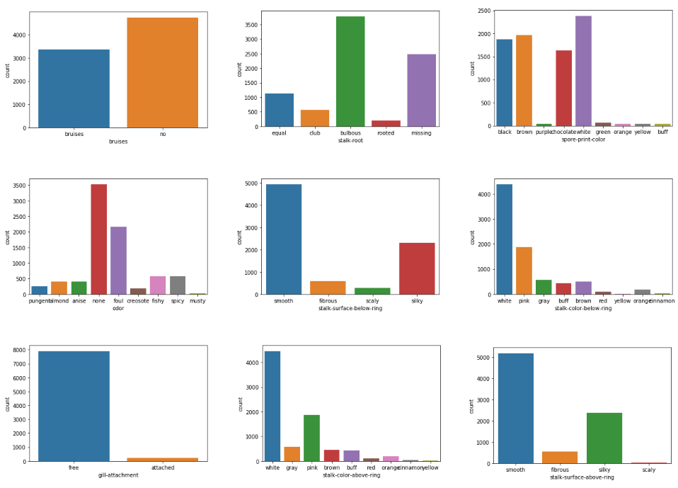

**How to run the Web App**
1. Clone/download this repo.
2. Open *appMushroom.py*.
3. To include the data export to MySQL, make sure you have the same account profile and database, or just delete lines that have to do with MySQL syntax.
4. Run *appMushroom.py*.
5. The server will run on 127.0.0.1:5000 which bring you to the login page:
    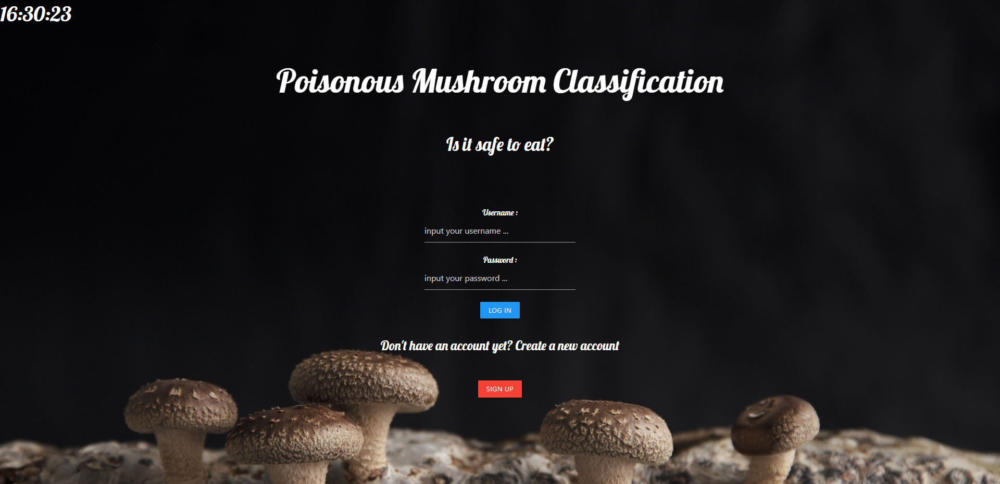
    This page serves as the landing page with a few buttons and inputs such as:
    - Username (input bar): enter registered username
    - Password (input bar): enter registered password
    - Login (button): button to log in to the specific user database
    - Signup (button): button to sign up new account

    Notes: signup are required to create a new account before login with existing account. Whenever a person create new account, a new table in 'mushroom' MySQL database is created. MySQL was used only to store prediction data which the user has input through homepage on Predicting Category. *404 Error* also included on the template.
    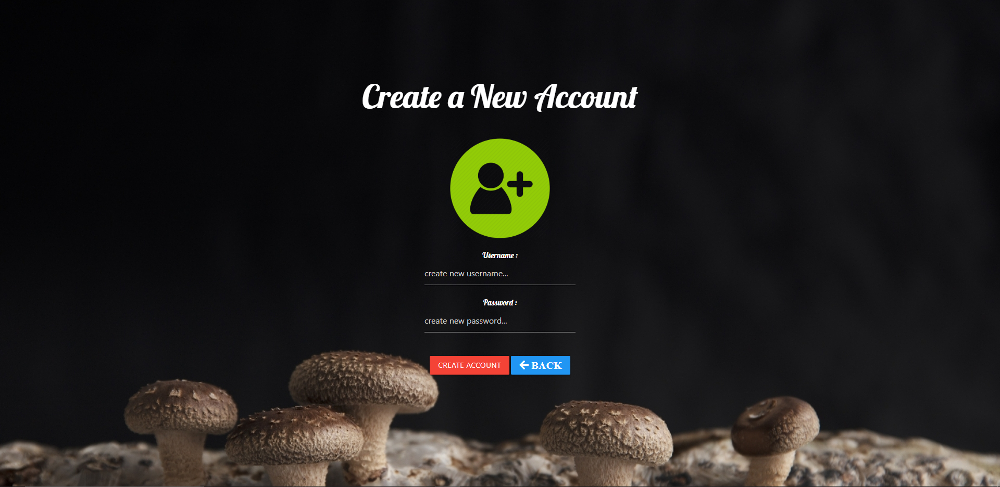

6. After Signing up/Login process, the user will be directed to the main page which consists of some option pane and menu navigation bar:
    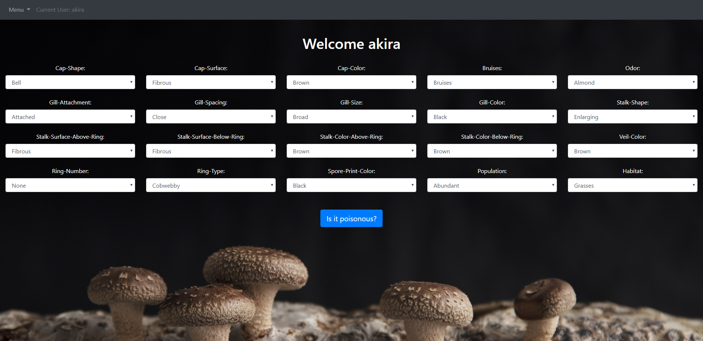

    In this app, there are several pages can found in NavBar:
    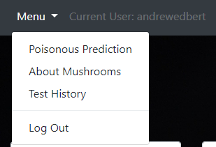

    1. Poisonous Prediction (Main Menu)
        The main menu is prediction menu. The corresponding user can try to predict whether the mushroom is poisonous or not.

        If a mushroom is indicated non-poisonous, then the following page will be prompted:
        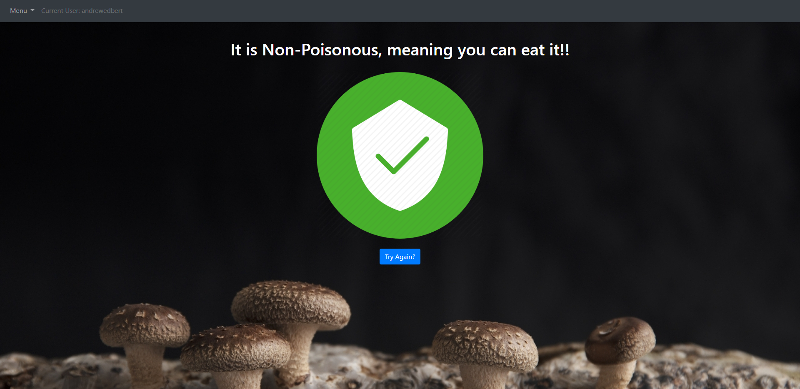
        If a mushroom is indicated poisonous, then the following page will be prompted:
        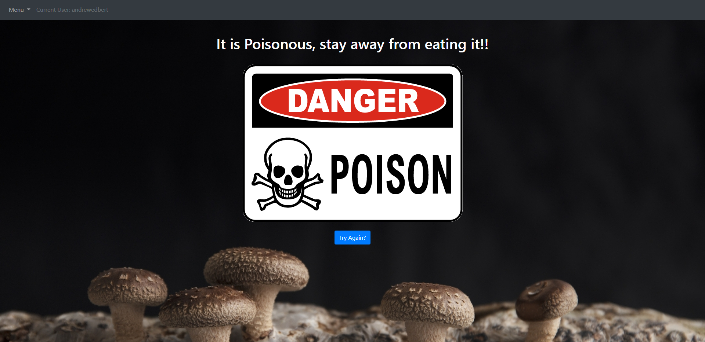
    2. About Mushrooms in general
        In this page, user can learn some small insight of mushrooms and general world of Fungus (Biological Fungi Kingdom)
        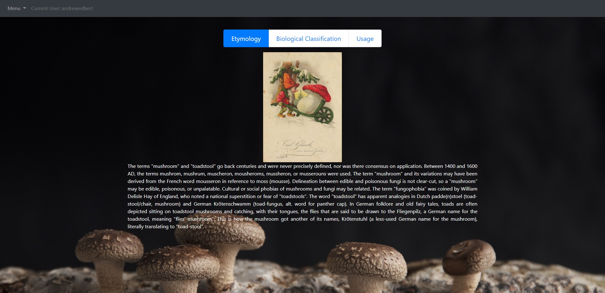
        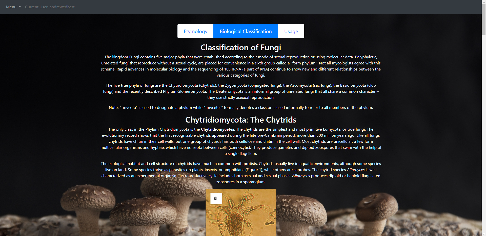
        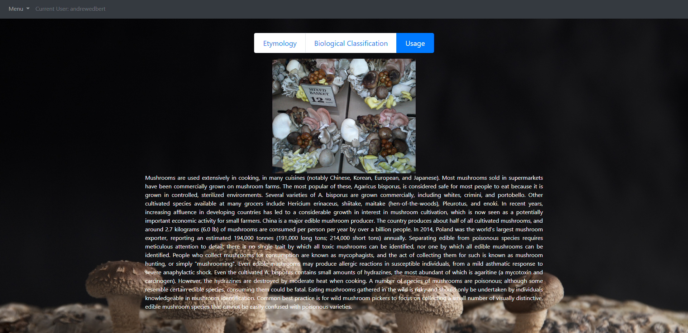
    3. Test History
        In this page, user can check any predicting activity that has occured
        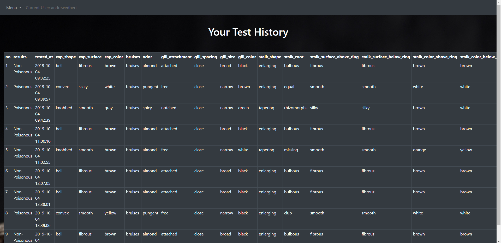
        Whenever a user try to predict a mushroom, the input will be recorded into the respective user data in MySQL. This can help the user to get previous information. This page load the MySQL table into html.

    

___
### Thank you for your attention. I hope you enjoy my debrief about this small project. 😊

#### ✉ _andrew.edbert@yahoo.com_